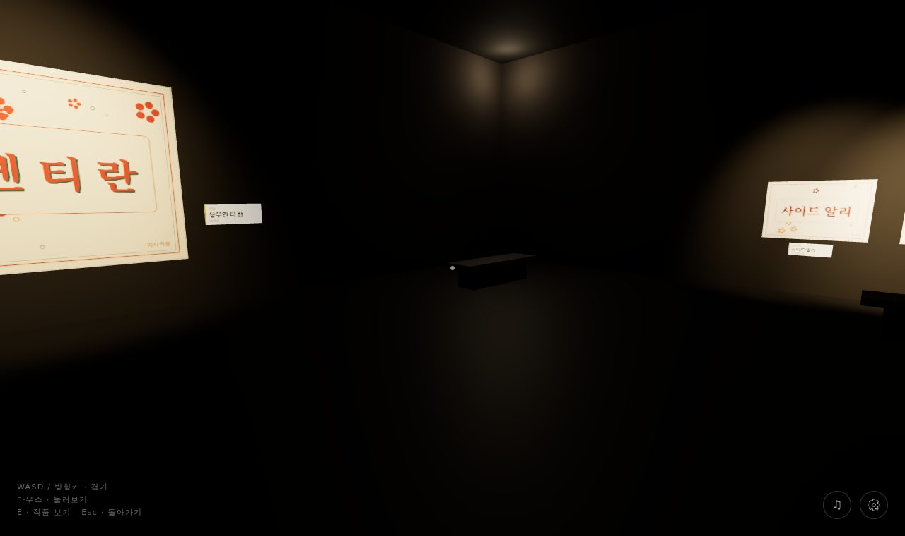

# 한글 이름 꾸미기 대회 · 수상작 3D 전시관

수상작 이미지와 캡션(이름·국적·수상 부문)만 넣으면, 계명대학교 캠퍼스를 본뜬 분수 광장을 한 바퀴 돌며 한 작품씩 감상하는 3D 전시가 만들어집니다.

 

- **정문**(흰 열주)을 지나 들어가면 창립 120주년 기념 분수를 가운데 둔 광장이 있고, 둘레로 **동산도서관·본관·채플**이 서 있습니다. 건물 정면은 실제 사진을 입힌 3D 모델입니다.
- 작품은 분수를 둘러싼 산책로 안쪽에 **대상 → 최우수상 → 우수상 → 장려상** 순서로 서 있어, 어느 작품을 보든 뒤로 분수와 건물이 보입니다. 부문이 바뀌는 곳에는 표지판이 있습니다.
- **스크롤·화면 밀기·‹ › 버튼·← → 키** 중 무엇으로든 다음 작품 앞까지 걸어가 멈춥니다. 키를 누르고 있을 필요가 없습니다.
- 아래 **작품 띠**나 **작품 목록**에서 원하는 작품을 누르면 그 작품 앞으로 바로 걸어갑니다.
- 작품 앞에 서면 캡션 카드(수상 부문·이름·국적·설명)가 뜨고, 작품이나 **크게 보기**를 누르면 원본 이미지를 크게 볼 수 있습니다.
- PC에서는 그림자·접촉면 그늘·빛번짐까지 그리고, 휴대폰에서는 자동으로 가볍게 그립니다.

---

## 1. 준비 (처음 한 번)

[Node.js](https://nodejs.org) 18 이상이 필요합니다. 터미널에서 이 폴더로 이동한 뒤:

```bash
npm install
```

## 2. 수상작 넣기 — `수상작/` 폴더만 고치면 됩니다

```
수상작/
├─ 수상작목록.csv   ← 캡션 (엑셀로 편집)
├─ 전시정보.json    ← 전시 제목·안내 문구
└─ *.jpg / *.png   ← 수상작 이미지
```

1. 지금 들어 있는 `예시_01.png` ~ `예시_10.png`는 **예시 작품**입니다. 지우고 실제 수상작 이미지를 넣으세요. (jpg·png·webp)
2. `수상작목록.csv`를 엑셀로 열어 한 줄에 한 작품씩 적습니다.

| 파일명 | 이름 | 국적 | 수상부문 | 작품설명 |
|---|---|---|---|---|
| 예시_01.png | 응우옌 티 란 | 베트남 | 대상 | 고향의 연꽃과 한글 이름을 함께 담았습니다. |
| 예시_02.png | 왕샤오위 | 중국 | 최우수상 | |

- **파일명**은 폴더 안 이미지 이름과 같아야 합니다. 확장자는 빼도 됩니다.
- **작품설명**은 비워도 됩니다. 비우면 명패와 캡션에 이름·국적·부문만 나옵니다.
- 엑셀에서 “CSV UTF-8” 또는 일반 “CSV” 중 어느 형식으로 저장해도 읽습니다.
- 같은 부문 안에서는 **CSV에 적은 순서**대로 걸립니다.
- 부문 이름과 순서는 `전시정보.json`의 `수상부문순서`에서 바꿀 수 있습니다. 예를 들어 “금상, 은상, 동상”을 쓰려면 이 목록을 그렇게 고치면 됩니다.

3. `전시정보.json`에서 첫 화면 문구를 고칩니다.

```json
{
  "상단문구": "계명대학교 한국어학당",
  "제목": "한글 이름 꾸미기 대회",
  "부제": "수상작 전시관",
  "소개문구": "나의 이름, 한글로 피어나다",
  "안내제목": "전시관에 오신 것을 환영합니다",
  "안내문": "입장 직후 화면 가운데 뜨는 안내 문장",
  "수상부문순서": ["대상", "최우수상", "우수상", "장려상", "입선"]
}
```

### 배경 360° 사진 (선택)

`수상작/` 폴더에 **360° 파노라마 사진**(가로:세로 = 2:1)을 **`배경.jpg`**로 넣으면 기본 공원 하늘 대신 그 사진이 사방 배경이 됩니다(빛은 기본 하늘 그대로). 일반 사진은 쓰지 않습니다.

- 학교 사진을 쓸 때는 사용 권한을 확인해 주세요. 출처 표기가 필요하면 `전시정보.json`에 적어 두면 첫 화면 아래에 작게 나옵니다.

```json
"배경출처": "배경 사진: 찍은 사람 · CC BY-SA 4.0 (Wikimedia Commons)",
"배경출처링크": "https://commons.wikimedia.org/wiki/File:..."
```

지금은 건물 사진 출처를 모은 [`public/credits.html`](public/credits.html)로 이어 두었습니다.

> 💡 이미지는 **긴 변 2000px 이하, 한 장 2MB 안팎**이면 휴대폰에서도 빠르게 뜹니다. 4MB가 넘으면 실행할 때 경고가 나옵니다.

## 3. 내 컴퓨터에서 확인

```bash
npm run dev
```

브라우저에서 http://localhost:3000 을 엽니다. 실행할 때마다 `수상작/` 폴더를 다시 읽으므로, 이미지나 CSV를 고친 뒤에는 **서버를 껐다 켜면** 반영됩니다.

실행하면 터미널에 이렇게 요약이 나옵니다. CSV와 이미지가 맞지 않으면 ⚠ 경고로 알려 줍니다.

```
✓ 수상작 10점 준비 완료 → public/exhibition.json
  대상 1 · 최우수상 2 · 우수상 3 · 장려상 4
```

## 4. 인터넷에 공개 (Vercel)

1. 이 폴더를 GitHub 저장소로 올립니다.
2. [vercel.com](https://vercel.com)에서 **Add New → Project**로 저장소를 가져옵니다. 설정은 기본값 그대로(Next.js) 둡니다.
3. 배포가 끝나면 나오는 주소를 공유하면 됩니다.

수상작을 바꿀 때는 `수상작/` 폴더를 고쳐서 GitHub에 올리기만 하면 Vercel이 자동으로 다시 배포합니다.

## 배경 모델 다시 만들기 (고칠 때만)

분수·나무·건물은 미리 만들어 `public/scenery/`에 넣어 두었으므로, 평소에는 할 일이 없습니다. 모양을 바꿀 때만 아래를 순서대로 실행합니다 ([Blender](https://www.blender.org) 4.2 이상 필요).

| 파일 | 만드는 것 |
|---|---|
| `scripts/scenery/gen-trees.mjs` | [ez-tree](https://github.com/dgreenheck/ez-tree)로 나무 8종 모양(OBJ) |
| `scripts/scenery/prep_facades.py` | 건물 사진의 원근을 바로잡고 하늘을 지운 외벽 텍스처 |
| `scripts/scenery/build_scenery.py` | Blender로 `fountain.glb`(분수, 그늘 굽기) · `trees.glb` · `campus.glb`(건물·정문) |

```bash
W=scenery-src   # 작업 폴더 (저장소에 넣지 않음)
node scripts/scenery/gen-trees.mjs $W/trees
python3 scripts/scenery/prep_facades.py $W/kmu $W/facades   # $W/kmu 에 건물 사진 (출처: public/credits.html)
/Applications/Blender.app/Contents/MacOS/Blender -b --factory-startup \
  --python scripts/scenery/build_scenery.py -- --work $W --out public/scenery
```

하늘(HDRI)·잔디·벽돌·화강암 재질은 [Poly Haven](https://polyhaven.com)(CC0)에서 받아 웹용으로 줄인 것입니다(`public/scenery/env`, `public/scenery/tex`).

## 조작법

| PC | 휴대폰 |
|---|---|
| 마우스 휠 / ← → 키 / ‹ › 버튼 · 다음·이전 작품 | 화면을 위·옆으로 밀기 / ‹ › 버튼 |
| 아래 작품 띠·**작품 목록** · 원하는 작품으로 이동 | **작품 목록** |
| 작품 클릭·Enter · 크게 보기 (Esc로 닫기) | 작품 누르기 · 크게 보기 |

---

## 참고: 원본 대비 바뀐 점

> 지금 전시 화면은 `src/components/gallery/`(분수 광장 둘레 산책로, 3D 배경은 `scene/`)입니다. 아래는 처음 만든 실내 전시관(`src/components/museum/`) 기준 설명이며, 그 코드는 `/editor`·`/admin`과 함께 남아 있지만 첫 화면에서는 쓰이지 않습니다.

이 프로젝트는 [museum-engine](https://github.com/gecapistrano/museum-engine)(MIT License)을 바탕으로 만들었습니다.

- `scripts/build-exhibition.mjs` 추가: `수상작/` 폴더의 이미지와 CSV를 읽어 `public/exhibition.json`과 `public/artworks/award-###.*`를 만듭니다. `npm run dev`와 `npm run build` 전에 자동으로 실행됩니다.
- 수상 부문 순으로 배치하고, 1순위 작품을 입구 정면 대표 작품으로 겁니다. 대표 작품도 다른 작품처럼 가까이 가서 볼 수 있습니다.
- 벽 명패(`Artwork.tsx`의 `WallLabel`)와 한국어 캡션 패널(`InspectOverlay.tsx`)을 추가했습니다.
- 작품 수에 맞춰 전시실이 넓어지고 가벽이 생기도록 바꿨습니다(`config.ts`의 `buildMuseum`). 원본에서 작품이 많으면 같은 자리에 겹쳐 걸리던 문제도 함께 고쳤습니다.
- 모든 화면 문구를 한국어로 바꾸고 Noto Sans/Serif KR 글꼴을 적용했습니다.
- 원본의 예시 명화와 불러오기 스크립트는 뺐습니다.

`/editor`(작품 위치 직접 조정)와 `/admin`(이미지 업로드) 화면은 원본 그대로 남아 있습니다. 다만 수상작 관리는 `수상작/` 폴더로 하는 방식이 기준입니다. `/admin`으로 올린 이미지는 다음 실행 때 지워집니다. `/editor`에서 저장한 위치는 `data/layout.json`에 남고, 캡션은 항상 CSV 내용을 따릅니다.

## License

Source code: MIT (원본 저작권 표시는 [LICENSE](LICENSE)에 있습니다). 수상작 이미지의 권리는 각 작가에게 있습니다.
